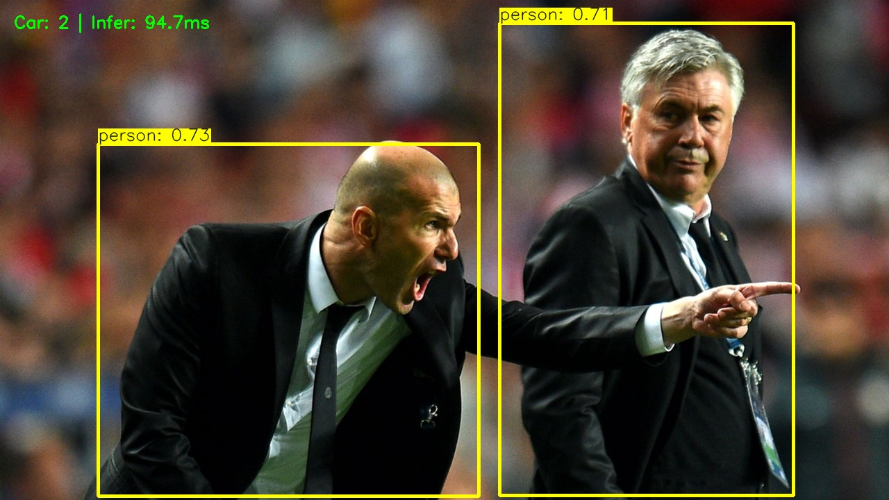
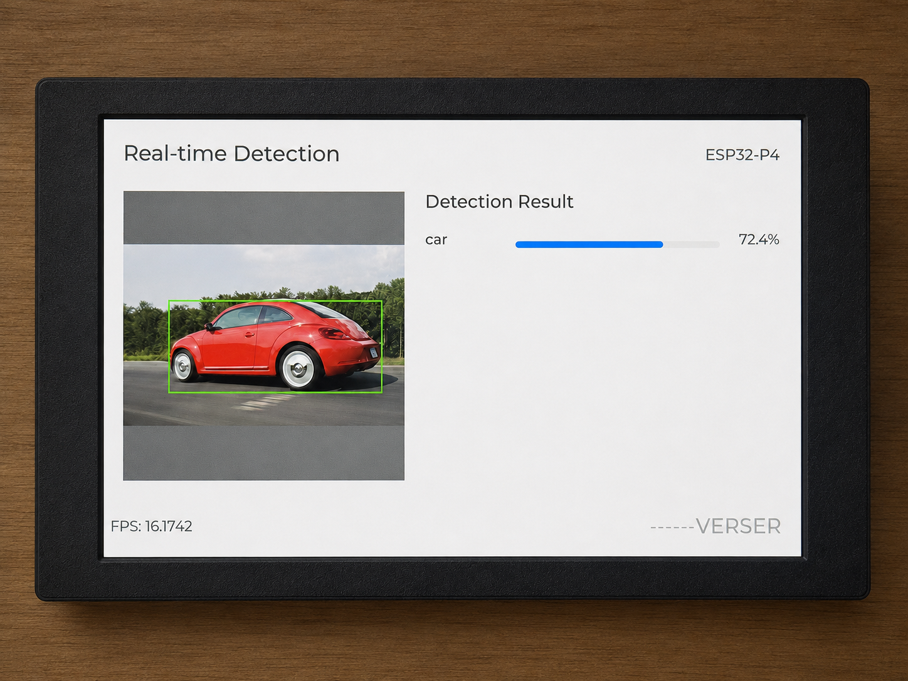

# GD-Net
### Lightweight Object Detection Framework for Microcontrollers (MCUs)

**English** | [简体中文](README.zh-CN.md)

<div align="center">

[](https://www.python.org/)
[](https://pytorch.org/)
[](https://www.tensorflow.org/lite/microcontrollers)
[](https://onnx.ai/)
[](#)
[](LICENSE)

</div>

> GD-Net is a lightweight object detection framework designed for resource-constrained devices such as microcontrollers. It combines ProxylessNAS/MCUNet backbones with a YOLO-style detection pipeline and supports on-device deployment through ONNX and TFLite.

---

## Overview

- **Lightweight detector**: Approximately 1.016M parameters with INT8 quantization support, suitable for hardware with limited SRAM and Flash.
- **Modern detection architecture**: YOLOv3-PANet, SPPF, and a decoupled head with multi-scale feature fusion for faster convergence.
- **NAS-driven backbones**: Supports MCUNet-VWW, MCUNet-ImageNet, LSNet, and other configurations for different resource budgets.
- **Edge deployment**: Includes ONNX and TFLite export scripts for embedded inference backends such as TensorFlow Lite for Microcontrollers.
- **Multiple annotation formats**: Supports both PASCAL VOC (XML) and YOLO (TXT) annotations.

---

## Detection Demo

| PC Detection | ESP32-P4 Deployment |
| :---: | :---: |
|  |  |

> ESP32-P4 deployment code for this model is available in [EdgeDetect-P4](https://github.com/Eaglewzw/EdgeDetect-P4).

---

## Architecture

| Module | Purpose | Key Files | Configuration |
| :--- | :--- | :--- | :--- |
| **Backbone** | Feature extraction | `gd_net/backbone_mcunet.py`, `backbone_lsnet.py` | `mcunet-vww` / `mcunet-imagenet` / `lsnet-t` |
| **Neck** | Receptive-field enhancement (SPPF) | `gd_net/neck.py` | Configurable pooling kernel size |
| **FPN** | Multi-scale feature fusion (PANet) | `gd_net/fpn.py` | `yolov3_panet` |
| **Head** | Decoupled detection head | `gd_net/head.py` | Separate classification and regression branches |
| **Assigner** | Anchor matching strategy | `gd_net/assigner.py` | Configurable IoU threshold |
| **Loss** | Multi-task loss | `gd_net/loss.py` | Configurable classification, regression, and objectness weights |

> All hyperparameters are managed in `cfg.py`, including anchor sizes, loss weights, backbone selection, and detection head settings.

---

## Performance (320×320 Input)

| Metric | Value | Notes |
| :--- | :--- | :--- |
| **Parameters** | 1.016M | Significantly smaller than mainstream edge models |
| **FLOPs** | 651.09M | Suitable for Cortex-M-class devices |
| **Flash Usage** | 4.90 MB (Float32) | Can be reduced further with INT8 quantization |

---

## Backbone Configurations

| Model ID | Resolution | Recommended Use |
| :--- | :---: | :--- |
| `mcunet-vww` | 160×160 | Balanced accuracy and speed for most MCU scenarios |
| `mcunet-imagenet` | 224×224 | Edge devices with more compute resources |
| `lsnet-t` | 224×224 | High-frame-rate detection |

> Pretrained weight paths are hard-coded in `gd_net/backbone_mcunet.py`. Check these paths before use.

---

## Quick Start

### 1. Requirements

- **Python**: 3.8+
- **Core**: PyTorch 1.10+, Torchvision
- **Tools**: OpenCV, PyYAML, thop
- **TFLite export (optional)**: onnx2tf

### 2. Installation

```bash
git clone https://github.com/Eaglewzw/GD_Net.git
cd GD_Net
pip install torch torchvision opencv-python PyYAML thop onnx onnxruntime
```

### 3. Dataset Preparation

Both VOC (XML) and YOLO (TXT) formats are supported. Select the format with the `label_format` field in the dataset `.yaml` file:

```yaml
# VOC format: path/Annotations/*.xml, path/ImageSets/Main/{train,val}.txt, path/JPEGImages/*.jpg
path: /path/to/dataset_root
label_format: voc
train: ImageSets/Main/train.txt
val: ImageSets/Main/val.txt
names: {0: drone}

# YOLO format: path/images/{train,val}/*.jpg + path/labels/{train,val}/*.txt
path: /path/to/dataset_root
label_format: yolo
train: images/train
val: images/val
names: {0: car}
```

### 4. Usage

```bash
# Train a model
python train.py --data data/vehicle.yaml --img-size 320 --batch-size 64 --epochs 300

# Run inference
python predict.py \
  --source assets/zidane.jpg \
  --weights checkpoints/car_yolov3_mcu.pth \
  --data data/standford.yaml \
  --output det_results

# Evaluate a model
python val.py --data data/vehicle.yaml --weights checkpoints/best_yolov3_mcu.pth       # YOLO format
python val_voc.py --data data/drone.yaml --weights checkpoints/best_yolov3_mcu.pth     # VOC format

# Export a model
python export.py --weights checkpoints/best_yolov3_mcu.pth --data data/vehicle.yaml    # ONNX
python export_tflite.py --weights checkpoints/best_yolov3_mcu.pth --data data/vehicle.yaml  # TFLite

# Run edge-format inference
python predict_onnx.py --source assets/img.png --onnx checkpoints/car_mcu.onnx --data data/vehicle.yaml
python predict_tflite.py --source assets/img.png --tflite checkpoints/car_mcu.tflite --data data/vehicle.yaml
```

---

> **Maintainer's note**: For more information about the model architecture or training strategy, see the modules under `gd_net/` or contact the development team.
