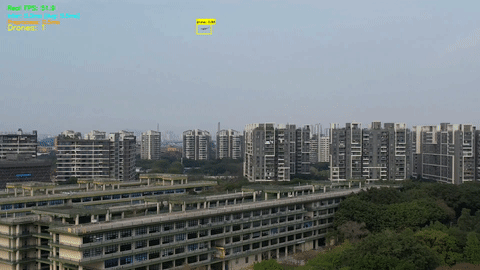

# GD_Net: Ultra-Lightweight YOLOv3 with MCUNet Backbone

<div align="center">


**An efficient, low-power object detection model designed for Edge Devices.**

</div>

---

## 📖 Introduction

**GD_Net** is a lightweight object detection architecture tailored for resource-constrained environments (IoT, Mobile, Embedded Systems). By replacing the standard Darknet backbone with **MCUNet (ProxylessNAS)** and utilizing a **Decoupled Head** design, GD_Net achieves an impressive balance between accuracy and efficiency.

The model is extremely compact (**~1MB parameters**) while maintaining robust detection capabilities through Feature Pyramid Networks (FPN/PAN) and SPPF modules.

### 🚀 Key Features
* **Backbone**: `mcunet-10fps_vww` (ProxylessNAS), optimized for microcontrollers.
* **Architecture**: YOLOv3-based with **Decoupled Heads** (separating classification and regression).
* **Neck**: Enhanced with **SPPF** and **C2f** modules.
* **Tiny Footprint**: Only **4.47 MB** on disk with **3.0G FLOPs** (@320x320).
<div align="center">
  
  <br> <em>视频展示</em> </div>

## 📊 Model Summary

Performance metrics based on input size `(1, 3, 640, 640)`:

| Metric | Value | Note |
| :--- | :--- | :--- |
| **Total Parameters** | **1,039,462 (1.04 M)** | Extremely Lightweight |
| **GFLOPs** | **480.041M** | Low Computation |
| **Model Size** | **4.47 MB** | Easy Deployment |
| **Inference Device** | CUDA / CPU | Tested on CUDA |

### Detailed Architecture Breakdown

| Module | Component | Params | % of Total |
| :--- | :--- | :--- | :--- |
| **Backbone** | MCUNet (ProxylessNAS) | 368,648 | ~35% |
| **Neck** | SPPF / C2f | 23,328 | ~2% |
| **FPN / PAN** | Feature Fusion | 143,184 | ~14% |
| **Head** | Decoupled Heads (x3) | 500,384 | ~48% |


```text
/home/verser/anaconda3/envs/YOLOVx/bin/python eval.py 
Using device: cuda
✅ MCUNet Backbone Init Done. Output Channels: [24, 48, 96]
======================================================================
                            MODEL SUMMARY                             
======================================================================
Input size                    : (1, 3, 256, 256)
Total params                  : 1,039,462 (1.039 M)
Trainable params              : 1,039,462 (1.039 M)
Non-trainable params          : 0 (0.000 M)
============================ FLOPs ===================================
  ├─ FLOPs                         : 480.041M
  ├─ Params (thop)                 : 920.486K
  ├─ Model size on disk            : 4.47 MB
======================================================================
````


## 📦 Backbone Zoo

GD\_Net 支持 MCUNet 系列和 LSNet 系列两类主干网络，通过 `cfg['backbone_type']` 一键切换。

### MCUNet 系列

每个模型都有固定的**设计输入分辨率**，训练时 `--img-size` 应与之对齐。
特征图尺寸以设计分辨率输入为准，P3/P4/P5 对应 stride=8/16/32 三个尺度。

| 模型文件 | 设计输入 | P3 特征图 (ch) | P4 特征图 (ch) | P5 特征图 (ch) | 推荐场景 |
| :--- | :---: | :---: | :---: | :---: | :--- |
| `mcunet-10fps_vww` | **64×64** | 8×8 (24) | 4×4 (40) | 2×2 (96) | 极低功耗 MCU |
| `mcunet-5fps_vww` | **80×80** | 10×10 (24) | 5×5 (40) | 2×2 (96) | 超轻量 VWW |
| `proxyless-w0.25-r112_imagenet` | **112×112** | 14×14 (16) | 7×7 (24) | 3×3 (48) | 通用轻量 |
| `mcunet-320kb-1mb_vww` | **144×144** | 18×18 (24) | 9×9 (40) | 4×4 (96) | VWW 任务 |
| `mcunet-256kb-1mb_imagenet` | **160×160** | 20×20 (24) | 10×10 (48) | 5×5 (96) | 均衡推荐 |
| `mcunet-512kb-2mb_imagenet` | **160×160** | 20×20 (40) | 10×10 (96) | 5×5 (192) | **当前默认，精度较高** |
| `mcunet-320kb-1mb_imagenet` | **176×176** | 22×22 (24) | 11×11 (48) | 5×5 (96) | 稍大分辨率 |
| `proxyless-w0.3-r176_imagenet` | **176×176** | 22×22 (16) | 11×11 (24) | 5×5 (64) | 通用大分辨率 |

> **注意**：MCUNet 是全卷积网络，可以接受任意分辨率输入，但训练时应使用对应的设计分辨率以保证特征图尺寸合理，避免 P5 特征图过小（如 2×2）导致检测退化。

### LSNet 系列

LSNet 的 Stem 固定为 3×stride=2，起始即 8 倍下采样，之后每个 Stage 间再 stride=2。
设计基准分辨率为 **224×224**，使用 LSNet 时 `--img-size` 建议设为 `224`。

| 版本 | 推荐输入 | P3 特征图 (ch) | P4 特征图 (ch) | P5 特征图 (ch) | 规模 |
| :--- | :---: | :---: | :---: | :---: | :--- |
| `lsnet_t` | **224×224** | 28×28 (64) | 14×14 (128) | 7×7 (256) | Tiny |
| `lsnet_s` | **224×224** | 28×28 (96) | 14×14 (192) | 7×7 (320) | Small |
| `lsnet_b` | **224×224** | 28×28 (128) | 14×14 (256) | 7×7 (384) | Base |

### 切换主干网络

在 `yolov3_mcu_config.py` 中修改以下字段：

```python
# 使用 MCUNet（默认）
cfg['backbone_type'] = 'mcunet'   # 同时修改 MODEL_ZOO 中的 json/pth 路径
# 训练时：python train_lr.py --img-size 160

# 使用 LSNet
cfg['backbone_type'] = 'lsnet'
cfg['lsnet_type']    = 'lsnet_t'  # 或 'lsnet_s' / 'lsnet_b'
# 训练时：python train_lr.py --img-size 224
```

-----

## 🖼️ Training Results

The following chart illustrates the training loss convergence:

> *The figure shows the bounding box, objectness, and classification losses decreasing over epochs.*

> 


-----

## 🛠️ Installation & Usage

### 1\. Requirements

Ensure you have Python 3.10+ and PyTorch installed.

```bash
opencv
```

### 2\. Inference / Evaluation

To evaluate the model on your dataset:

```bash
python infernence.py
```

### 3\. Training

To train GD\_Net from scratch using the MCUNet backbone:

```bash
python train_lr.py
```

-----

## 🤝 Acknowledgements

  * **MCUNet**: For the efficient ProxylessNAS backbone architecture.
  * **YOLO**: For the object detection head design concepts.

-----