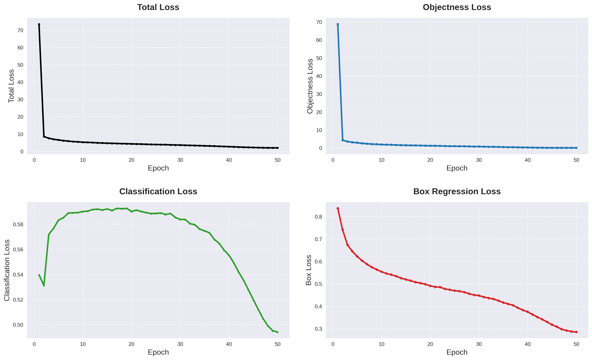

# GD_Net: Ultra-Lightweight YOLOv3 with MCUNet Backbone

<div align="center">


**An efficient, low-power object detection model designed for Edge Devices.**

</div>

---

## 📖 Introduction

**GD_Net** is a lightweight object detection architecture tailored for resource-constrained environments (IoT, Mobile, Embedded Systems). By replacing the standard Darknet backbone with **MCUNet (ProxylessNAS)** and utilizing a **Decoupled Head** design, GD_Net achieves an impressive balance between accuracy and efficiency.

The model is extremely compact (**~1MB parameters**) while maintaining robust detection capabilities through Feature Pyramid Networks (FPN/PAN) and SPPF modules.

### 🚀 Key Features
* **Backbone**: `mcunet-10fps_vww` (ProxylessNAS), optimized for microcontrollers.
* **Architecture**: YOLOv3-based with **Decoupled Heads** (separating classification and regression).
* **Neck**: Enhanced with **SPPF** and **C2f** modules.
* **Tiny Footprint**: Only **4.47 MB** on disk with **3.0G FLOPs** (@320x320).
<div align="center">
  
  <br> <em>视频展示</em> </div>

## 📊 Model Summary

Performance metrics based on input size `(1, 3, 640, 640)`:

| Metric | Value | Note |
| :--- | :--- | :--- |
| **Total Parameters** | **1,039,462 (1.04 M)** | Extremely Lightweight |
| **GFLOPs** | **480.041M** | Low Computation |
| **Model Size** | **4.47 MB** | Easy Deployment |
| **Inference Device** | CUDA / CPU | Tested on CUDA |

### Detailed Architecture Breakdown

| Module | Component | Params | % of Total |
| :--- | :--- | :--- | :--- |
| **Backbone** | MCUNet (ProxylessNAS) | 368,648 | ~35% |
| **Neck** | SPPF / C2f | 23,328 | ~2% |
| **FPN / PAN** | Feature Fusion | 143,184 | ~14% |
| **Head** | Decoupled Heads (x3) | 500,384 | ~48% |


```text
/home/verser/anaconda3/envs/YOLOVx/bin/python eval.py 
Using device: cuda
✅ MCUNet Backbone Init Done. Output Channels: [24, 48, 96]
======================================================================
                            MODEL SUMMARY                             
======================================================================
Input size                    : (1, 3, 256, 256)
Total params                  : 1,039,462 (1.039 M)
Trainable params              : 1,039,462 (1.039 M)
Non-trainable params          : 0 (0.000 M)
============================ FLOPs ===================================
  ├─ FLOPs                         : 480.041M
  ├─ Params (thop)                 : 920.486K
  ├─ Model size on disk            : 4.47 MB
======================================================================
````


## 📦 Backbone Zoo

GD\_Net supports various MCUNet-based backbones to balance speed and accuracy.

| Model File | Size | Recommended Scenario |
| :--- | :--- | :--- |
| **`mcunet-10fps_vww.pth`** | **1.5 MB** | **Default (Balanced)** |
| `mcunet-5fps_vww.pth` | 1.8 MB | Ultra Low Power |
| `proxyless-w0.25-r112_imagenet.pth`| 2.3 MB | General Purpose |
| `mcunet-320kb-1mb_vww.pth` | 2.7 MB | Visual Wake Words |
| `mcunet-256kb-1mb_imagenet.pth` | 2.9 MB | ImageNet Classification |
| `mcunet-320kb-1mb_imagenet.pth` | 2.9 MB | ImageNet Classification |
| `mcunet-512kb-2mb_imagenet.pth` | 6.8 MB | Higher Accuracy |

-----

## 🖼️ Training Results

The following chart illustrates the training loss convergence:

> *The figure shows the bounding box, objectness, and classification losses decreasing over epochs.*

> 


-----

## 🛠️ Installation & Usage

### 1\. Requirements

Ensure you have Python 3.8+ and PyTorch installed.

```bash
opencv
```

### 2\. Inference / Evaluation

To evaluate the model on your dataset:

```bash
python infernence.py
```

### 3\. Training

To train GD\_Net from scratch using the MCUNet backbone:

```bash
python train_lr.py
```

-----

## 🤝 Acknowledgements

  * **MCUNet**: For the efficient ProxylessNAS backbone architecture.
  * **YOLO**: For the object detection head design concepts.

-----