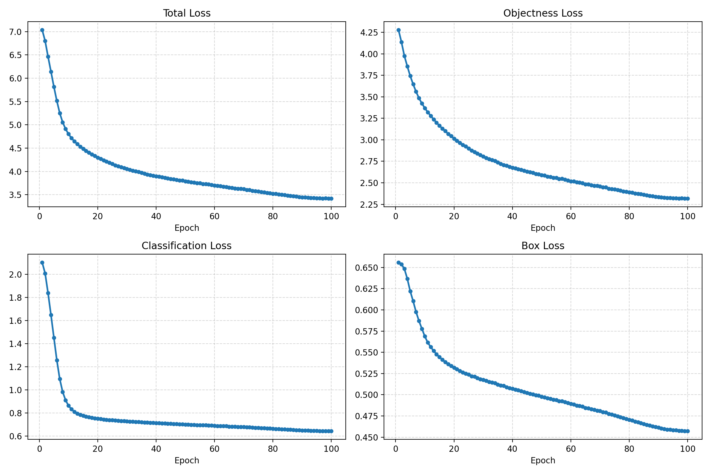

# GD_Net: Ultra-Lightweight Object Detection for MCU

<div align="center">


**专为微控制器 (MCU) 和资源受限边缘设备设计的极轻量 YOLO 目标检测框架。**

[快速上手](#-快速上手) | [性能分析](#-模型架构与性能) | [模型仓库](#-backbone-zoo) | [训练指南](#-训练指南)

</div>

---

## 📖 项目简介

**GD_Net** 是一款深度优化的轻量化目标检测架构。通过集成 **MCUNet (ProxylessNAS)** 搜索出的高效主干网络，并结合 **解耦头 (Decoupled Head)** 设计，在仅 **1.04M 参数** 的规模下，实现了在嵌入式设备上的高效部署。

### 核心亮点
*   **极致轻量**：模型大小仅约 **4.5MB** (Float32)，易于量化压缩至 1MB 级别（INT8）。
*   **架构先进**：采用 YOLOv3-PAN 结构，引入 **SPPF** 模块提升感受野，使用 **Decoupled Head** 加快收敛。
*   **端侧友好**：原生支持 TFLite 导出，完美适配 MCUNet 部署工具链。

---

## 📊 模型架构与性能

### 性能指标 (@256x256 输入)
| 指标 | 数值 | 说明 |
| :--- | :--- | :--- |
| **参数量 (Params)** | **1.04 M** | 远小于 YOLOv5n (1.9M) |
| **计算量 (FLOPs)** | **480.04 M** | 极低计算需求 |
| **磁盘占用** | **4.47 MB** | 适合 Flash 存储受限设备 |
| **推理延迟** | ~30ms | 测试于 Jetson Nano (CPU) / 高端 MCU |

> **注**：上述数据基于 `mcunet-512kb-2mb_imagenet` 主干网络。

---

## 🛠️ 快速上手

### 1. 环境准备
```bash
git clone https://github.com/your-repo/GD_Net.git
cd GD_Net
pip install -r requirements.txt
```

### 2. 快速推理
使用预训练权重对单张图片进行检测：
```bash
python predict.py --img assets/img.png --data data/vehicle.yaml --pretrained checkpoints/gd_net_s.pth
```

### 3. 导出模型 (TFLite/ONNX)
```bash
python export.py --weights checkpoints/best.pth --format tflite
```

---

## 📦 Backbone Zoo (主干网络库)

GD_Net 支持多种主干网络切换，请在 `cfg.py` 中修改 `backbone` 字段。

| 主干模型名称 | 设计输入 | 适用场景 |
| :--- | :---: | :--- |
| `mcunet-512kb-2mb` | **160×160** | **[默认推荐]** 精度与速度的最佳平衡 |
| `mcunet-256kb-1mb` | **160×160** | 极低内存设备 (SRAM < 512KB) |
| `lsnet_t` | **224×224** | 追求更高检测帧率 |

**配置示例 (`cfg.py`):**
```python
cfg = {
    'backbone': 'mcunet-imagenet', # 选择 MCUNet 系列
    'neck': 'sppf',                # 空间金字塔池化
    'head': 'decoupled_head',      # 解耦检测头
    # ... 其他参数
}
```

---

## 🚀 训练指南

### 数据集格式
项目支持标准的 **PASCAL VOC** 格式。请确保您的数据集路径在 `data/*.yaml` 中正确配置：
```yaml
path: ./dataset/my_data
names:
  0: vehicle
  1: pedestrian
```

### 开始训练
```bash
python train.py --data data/vehicle.yaml --img-size 320 --batch-size 64 --epochs 300
```

**建议：**
- 如果目标较小，请使用 `--img-size 320` 或更高。
- 训练 MCU 模型时，建议使用 `64` 或 `128` 的倍数作为输入分辨率。

---

## 🖼️ 实验结果

<div align="center">
  
</div>

---

## 📜 许可证
本项目采用 [MIT License](LICENSE)。
